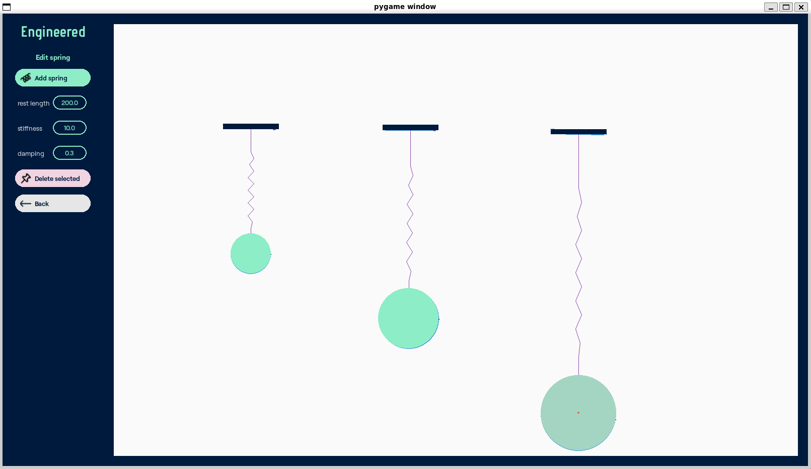
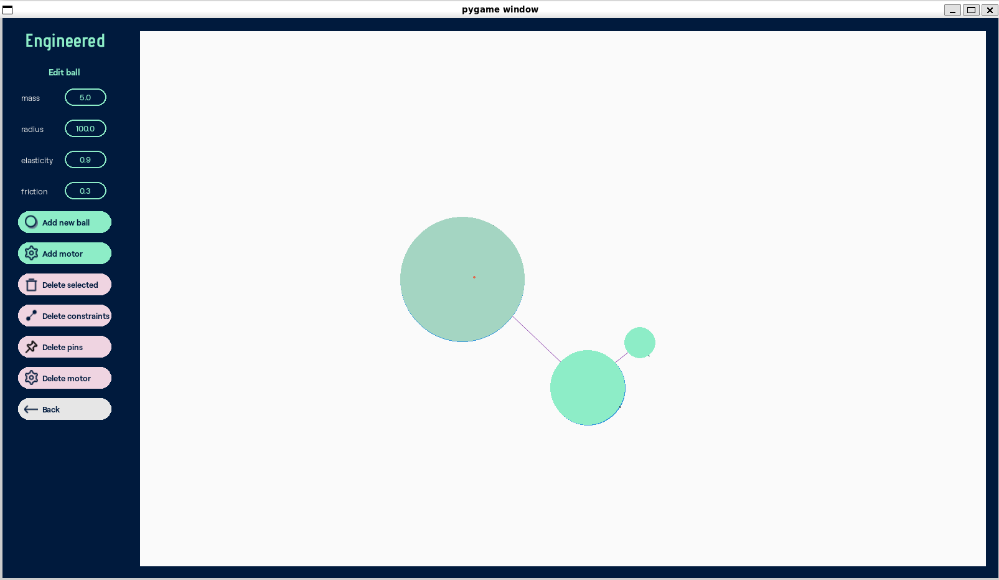
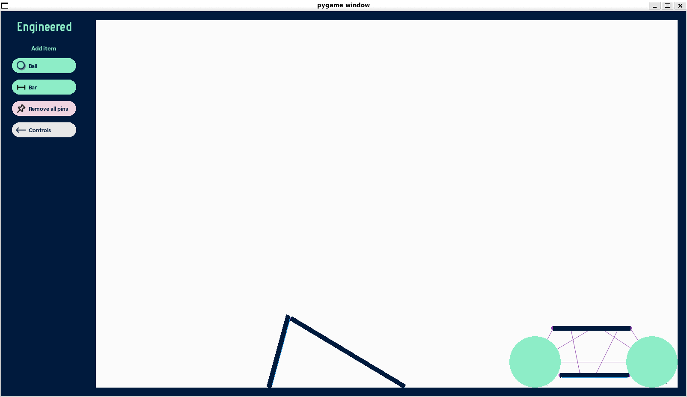

# Engineered

This project is a GUI for the [Pymunk](https://www.pymunk.org/) physics engine. Experiment with different objects, springs, joints and motors to explore physics concepts or simply have fun building amusing contraptions and structures. 

The user interface is built using [Pygame](https://www.pygame.org/).

**Note:** I'm hoping to develop this further into a game where the user has to build a vehicle to overcome obstacle courses of increasing difficulty. But for now you just get the vehicle building stage, which is essentially a physics simulator.  






--- 

## Educational Use Cases

This simulator can be a fun and powerful educational tool:
- Visualizing Newtonian physics concepts (e.g. forces, motion, energy).
- Experimenting with springs, e.g. demonstrating Hooke's law
- Demonstrating conservation laws e.g. energy, angular momentum.
- Modelling friction, elasticity and damping
- Even demonstrating statistical laws e.g. by building a Galton Board. 
- Teaching coding and physics principles together.

---

## Features

- **Interactive Physics**: Add, move, and modify dynamic objects in a live simulation environment.
- **Constraints System**: Connect objects with damped springs, pivot joints, and motors.
- **Object Anchoring**: Precisely control interaction points using anchor markers.
- **Static objects**: Create static objects by pinning objects to the background. 
  
---

## 🔧 Installation

### Prerequisites

Make sure you have Python 3.9+ installed.

### 1. Clone the Repository

```bash
git clone https://github.com/luoshanico/engineered.git
cd engineered
```

### 2. Create and Activate a Virtual Environment

```bash
# Create venv
python -m venv venv

# Activate (on macOS/Linux)
source venv/bin/activate

# Activate (on Windows)
venv\Scripts\activate
```

### 3. Install Dependencies

```bash
pip install -r requirements.txt
```

### 4. Running the program
```bash
python src/main.py
```
---

## Controls
- **Left click:** grab object
- **Ctrl-left-click:** select object, place anchor point for constraints
- **Space bar:** pin grabbed object to background
- **Delete:** delete object

---

## Contributing
Pull requests and ideas welcome! Feel free to open an issue to discuss improvements or features.

---

## Author
Nico Worrall
github.com/luoshanico

---

## License
MIT License. See LICENSE for details.


